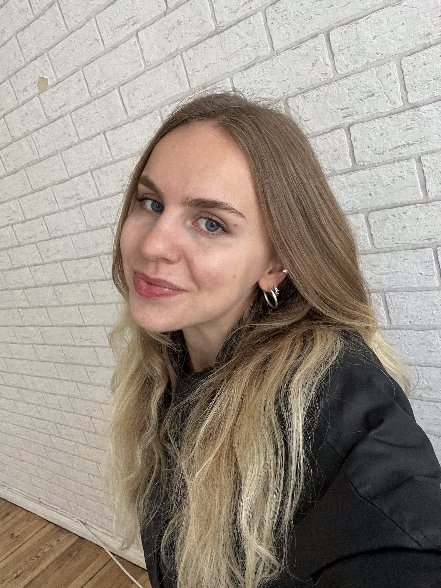
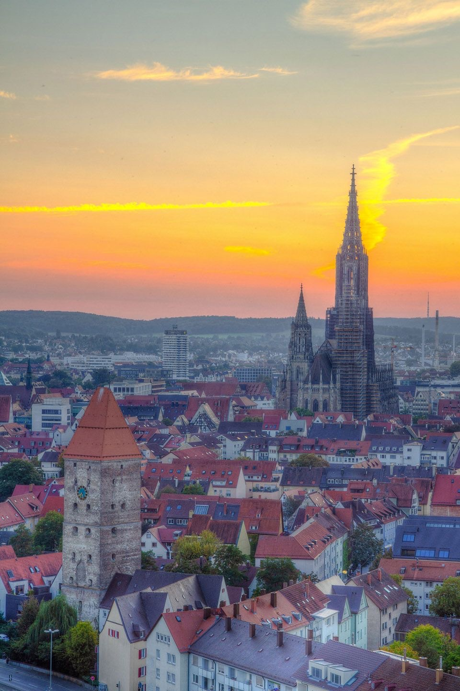
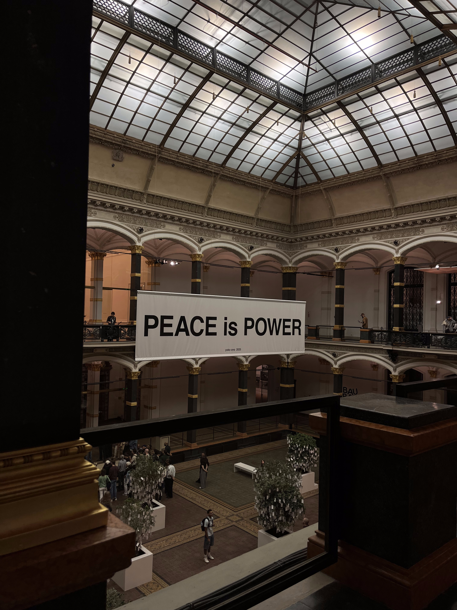
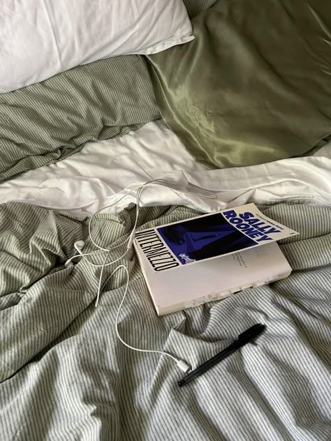
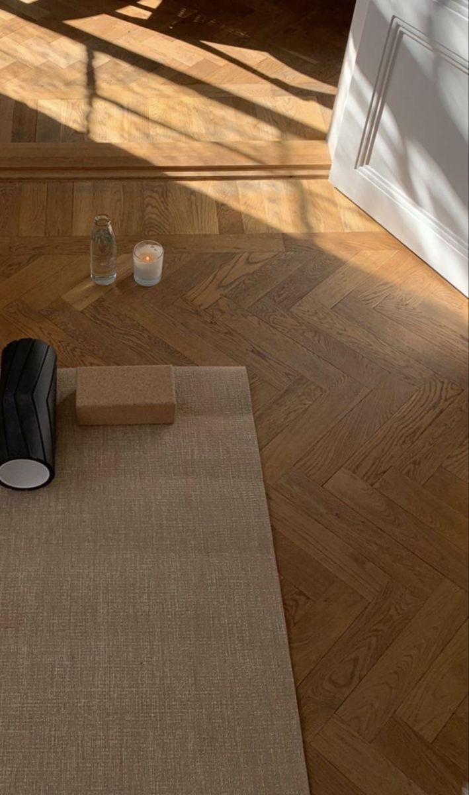

# Christina Müller's Story

---

## 🎓 Current Position

**Master’s Student in Business Intelligence and Process Management**  
**Berlin School of Economics and Law (HWR Berlin)**  

🔗 [LinkedIn](https://www.linkedin.com/in/christina-m%C3%BCller-9214a92aa/)  
💻 [GitHub](https://github.com/Christina-Mueller)  

---

## 🏙️ Born and Raised

**Ulm, Germany** — Growing up and Abitur (until 2020)  

---

## 💭 What I Like

- Anything **design and art** related — visiting art galleries and museums, exploring interior and architectural design, and watching documentaries and video essays  
- **Reading books**  
- **Doing yoga**

  
  
  

---

## 🎓 Academic Journey

### Stops Along the Way

| Period     | Location          | Experience                                                        |
| :---------- | :---------------- | :---------------------------------------------------------------- |
| Until 2020  | Ulm, Germany      | Growing up and Abitur                                             |
| 2020–2021   | Paris, France     | Work and Travel (COVID style)                                     |
| 2021–2024   | Wildau, Germany   | Bachelor in European Business Management                          |
| 2021–2024   | Berlin, Germany   | Working Student in Marketing (Startup)                            |
| 2024        | Lille, France     | Exchange Semester                                                 |
| 2024–2025   | Munich, Germany   | Intern & Working Student at BMW (Product Management)              |
| Since 2025  | Berlin, Germany   | Master in Business Intelligence and Process Management (HWR Berlin) |

---

## 🗺️ My Academic & Career Journey Map

<iframe 
  src="https://christina-mueller.github.io/BIPM2025/academic_journey_map.html" 
  width="100%" 
  height="600" 
  style="border:none; border-radius:10px; box-shadow: 0 4px 12px rgba(0,0,0,0.1);">
</iframe>

